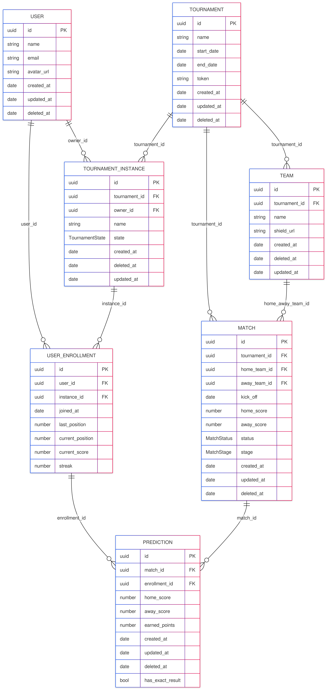

# SkorifyData

Migraciones de base de datos para la Polla Mundial usando Knex + PostgreSQL en Docker

## Modelo Entidad Relacion




## Codigo Mermeid del modelo
```mermeid
---
config:
  look: neo
  theme: mc
---
erDiagram
	direction RL
	USERS {
		uuid id PK ""  
		varchar name  ""  
		varchar email  "UNIQUE"  
		varchar password_hash  ""  
		varchar avatar_url  ""  
		varchar role  "general | global | instance"  
		timestamp created_at  ""  
		timestamp updated_at  ""  
		timestamp deleted_at  ""  
	}

	TOURNAMENTS {
		uuid id PK ""  
		varchar name  ""  
		date start_date  ""  
		date end_date  ""  
		timestamp created_at  ""  
	}

	PAYMENTS {
		uuid id PK ""  
		uuid user_id FK ""  
		uuid tournament_id FK ""  
		varchar state_pay  "failed | pending | paid"  
		timestamp created_at  ""  
		timestamp updated_at  ""  
	}

	TEAMS {
		uuid id PK ""  
		varchar name  ""  
		varchar code  "UNIQUE"  
		varchar shield_url  ""  
		timestamp created_at  ""  
		timestamp updated_at  ""  
		timestamp deleted_at  ""  
	}

	TOURNAMENT_TEAMS {
		uuid id PK ""  
		uuid team_id FK ""  
		uuid tournament_id FK ""  
	}

	GROUPS {
		uuid id PK ""  
		uuid tournament_id FK ""  
		varchar group_name  ""  
		timestamp created_at  ""  
		timestamp updated_at  ""  
		timestamp deleted_at  ""  
	}

	GROUP_TEAMS {
		uuid id PK ""  
		uuid team_id FK ""  
		uuid group_id FK ""  
	}

	MATCHES {
		uuid id PK ""  
		uuid home_team_id FK ""  
		uuid away_team_id FK ""  
		uuid tournament_id FK ""  
		timestamp kick_off  ""  
		int home_goals  ""  
		int away_goals  ""  
		varchar status  "'scheduled' | 'in_progress' | 'finished'"  
		varchar stage  "group | finals"  
		varchar venue  ""  
		timestamp created_at  ""  
		timestamp updated_at  ""  
	}

	PREDICTIONS {
		uuid id PK ""  
		uuid instance_player_id FK ""  
		uuid match_id FK ""  
		int pred_home_goals  ""  
		int pred_away_goals  ""  
		int earned_points  ""  
		timestamp created_at  ""  
		timestamp updated_at  ""  
		timestamp deleted_at  ""  
		varchar user_id_match_id  "UNIQUE"  
	}

	LEADERBOARD {
		uuid id PK ""  
		uuid user_id FK ""  
		uuid tournament_id FK ""  
		int position ""
		int total_points  ""  
		int exact_hits  ""  
		int outcome_hits  ""  
		timestamp created_at  ""  
		timestamp updated_at  ""  
	}

	INSTANCES {
		uuid id PK ""
		uuid tournament_id FK
		uuid owner_user_id FK
		uuid validator_user_id FK
		varchar state "approved, pending, denied"
		varchar name
		int price
		timestamp update_at
		timestamp deleted_at
		timestamp created_at
	}

	INSTANCE_USERS {
		uuid id PK
		uuid player_id FK
		uuid instance_id FK
		timestamp joined_at
		timestamp created_at
	}
	INSTANCE_RULES {
		uuid id PK
		uuid instance_id FK
		uuid rule_id FK
		timestamp created_at
	}
	%% Reglas para cada instancia
	RULES {
		uuid id
		varchar name
		varchar description
		timestamp created_at 
	}

	INSTANCES||--o{INSTANCE_RULES: ""
	RULES||--o{INSTANCE_RULES: ""

	TOURNAMENTS||--o{INSTANCES: ""
	USERS||--o{INSTANCE_USERS: ""
	INSTANCES||--o{INSTANCE_USERS:""
	USERS||--o{LEADERBOARD:"ranks"
	TOURNAMENTS||--o{LEADERBOARD:"ranks"
	INSTANCE_USERS||--o{PREDICTIONS:"makes"
	MATCHES||--o{PREDICTIONS:"has"
	TEAMS||--o{TOURNAMENT_TEAMS:"belong_to"
	TOURNAMENTS||--o{TOURNAMENT_TEAMS:"belong_to"
	TOURNAMENTS||--o{MATCHES:"contains"
	TEAMS||--o{MATCHES:"home_team"
	TEAMS||--o{MATCHES:"away_team"
	TEAMS||--o{GROUP_TEAMS:"belongs"
	GROUPS||--o{GROUP_TEAMS:"has"
	TOURNAMENTS||--o{GROUPS:"defines"
	USERS||--o{PAYMENTS:"pays"
	TOURNAMENTS||--o{PAYMENTS:"belong"
```
## Requisitos

- Node.js 24.14.1 (LTS)
- Docker 28.3.0+
- Docker Compose v2

## Funcionamiento

Este proyecto tiene 2 piezas:

1. **PostgreSQL** (contenedor postgres)
    - Guarda los datos
    - Se levanta con Docker
2. **Knex** (contenedor knex)
    - Ejecuta migraciones
    - Crea las tablas en la base de datos

```
Levantas PostgreSQL → Espera a estar listo → Ejecutas Knex → Se crean tablas
```

## Onboarding de equipo (paso a paso)


1. Variables de Entorno

```bash
DB_HOST=postgres
DB_PORT=5432
DB_NAME=polla_mundial
DB_USER=postgres
DB_PASSWORD=password
```

2. Levantamiento Automático 

```bash
docker compose up --build
```
Esto hace:
- Crea el contenedor skorify_db y espera a que esté listo (healthcheck).

- Ejecuta automáticamente knex migrate:latest para crear las tablas.

- Inicia el dev-server una vez que la base de datos está preparada.


## Verificar que TODO funciona

```bash
docker exec -it skorify_db psql -U postgres -d polla_mundial -c "\dt"
```
Si todo sale bien, verás las tablas en tu pestaña de logs

## Scripts disponibles

``` bash
# Levanta SOLO PostgreSQL
npm run db:up

# Elimina contenedores y red
npm run db:down

# Ejecuta migraciones (crea tablas)
npm run migrate

# Ver estado de migraciones
npm run status

# Revierte última migración
npm run rollback

# Flujo completo (lo que deberías usar)
npm run setup

# Alias de status
npm run verify
```

## Instalar la librería desde GitHub

Si quieres consumir esta librería en otro proyecto TypeScript sin publicarla a npm, puedes instalarla directo desde el repositorio.

1. Requisito: usar una referencia estable (tag o commit SHA) para evitar cambios inesperados.

2. Instalar con `pnpm`:

```bash
pnpm add "git+https://github.com/<org>/<repo>.git#<tag-o-sha>"
```

Ejemplo:

```bash
pnpm add "git+https://github.com/skorify/skorify-data.git#v1.0.0"
```

3. Si el repositorio es privado, usa SSH:

```bash
pnpm add "git+ssh://git@github.com/<org>/<repo>.git#<tag-o-sha>"
```

Notas importantes:
- Esta librería compila el código TypeScript durante el empaquetado (`prepack`), por lo que no necesitas versionar `dist` en el repositorio.
- Para producción, fija siempre una versión (`tag`) o un commit SHA en lugar de `main`.

## En caso de romperlo todo
```bash
docker compose down -v
npm run setup
```
Esto:
- Borra base de datos
- Borra volúmenes
- Crea todo desde cero
