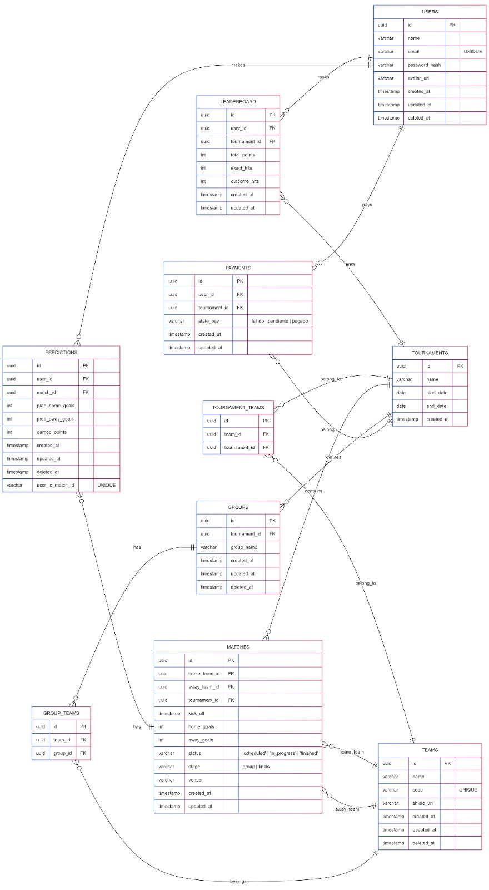

# SkorifyData

Migraciones de base de datos para la Polla Mundial usando Knex + PostgreSQL en Docker

## Modelo Entidad Relacion



## Requisitos

- Node.js 24.14.1 (LTS)
- Docker 28.3.0+
- Docker Compose v2

## Funcionamiento

Este proyecto tiene 2 piezas:

1. **PostgreSQL** (contenedor postgres)
    - Guarda los datos
    - Se levanta con Docker
2. **Knex** (contenedor knex)
    - Ejecuta migraciones
    - Crea las tablas en la base de datos

```
Levantas PostgreSQL → Espera a estar listo → Ejecutas Knex → Se crean tablas
```

## Onboarding de equipo (paso a paso)

1. Instalar dependencias de Node (opcional si usaras solo migraciones dockerizadas):

```bash
npm ci
```

2. Crear entorno local y completar con los siguientes datos:

```bash
DB_HOST=postgres
DB_PORT=5432
DB_NAME=
DB_USER=
DB_PASSWORD=
```
## Forma corta
```bash
    docker compose up -d
    npx knex migrate:up
    npm run seed
```

3. Levantar PostgreSQL:

```bash
npm run db:up
```
Esto hace:
- Crea contenedor skorify_db
- Expone puerto 5432
- Espera a que la DB esté lista (healthcheck)

4. Aplicar migraciones:

```bash
npm run migrate
```
Esto hace:
- Levanta contenedor temporal knex
- Ejecuta:

```bash
npx knex migrate:latest
```
- Para crear todas las tablas

## Verificar que TODO funciona

```bash
docker exec -it skorify_db psql -U postgres -d polla_mundial -c "\dt"
```
Si todo sale bien, verás las tablas en tu pestaña de logs

## Scripts disponibles

``` bash
# Levanta SOLO PostgreSQL
npm run db:up

# Elimina contenedores y red
npm run db:down

# Ejecuta migraciones (crea tablas)
npm run migrate

# Ver estado de migraciones
npm run status

# Revierte última migración
npm run rollback

# Flujo completo (lo que deberías usar)
npm run setup

# Alias de status
npm run verify
```

## Instalar la librería desde GitHub

Si quieres consumir esta librería en otro proyecto TypeScript sin publicarla a npm, puedes instalarla directo desde el repositorio.

1. Requisito: usar una referencia estable (tag o commit SHA) para evitar cambios inesperados.

2. Instalar con `pnpm`:

```bash
pnpm add "git+https://github.com/<org>/<repo>.git#<tag-o-sha>"
```

Ejemplo:

```bash
pnpm add "git+https://github.com/skorify/skorify-data.git#v1.0.0"
```

3. Si el repositorio es privado, usa SSH:

```bash
pnpm add "git+ssh://git@github.com/<org>/<repo>.git#<tag-o-sha>"
```

Notas importantes:
- Esta librería compila el código TypeScript durante el empaquetado (`prepack`), por lo que no necesitas versionar `dist` en el repositorio.
- Para producción, fija siempre una versión (`tag`) o un commit SHA en lugar de `main`.

## En caso de romperlo todo
```bash
docker compose down -v
npm run setup
```
Esto:
- Borra base de datos
- Borra volúmenes
- Crea todo desde cero