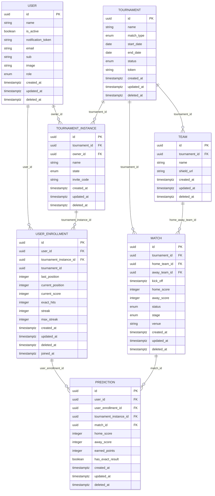

# SkorifyData

Librería de capa de datos e infraestructura serverless en AWS para una plataforma de predicciones deportivas.

## Descripción general

SkorifyData tiene dos responsabilidades:

1. **Librería TypeScript** — `DBClient` que envuelve servicios de entidades para acceso a Postgres, consumida por el backend
2. **Infraestructura AWS CDK** — Workers Lambda que ingestan datos de partidos desde football-data.org y ejecutan el pipeline de puntuación de predicciones

## Inicio rápido

```bash
pnpm run setup    # levanta Postgres + aplica todas las migraciones
pnpm run seed     # carga datos iniciales de referencia
```

→ Ver [docs/DATABASE.md](docs/DATABASE.md) para comandos de migración e historial.

## Modelo Entidad Relación




→ Ver [docs/ENTITIES.md](docs/ENTITIES.md) para campos de entidades y API de servicios.

## Entidades expuestas como servicios

La librería expone cada entidad como un servicio que extiende `BaseDataService<T>` (ver [lib/services/README.md](lib/services/README.md) para el detalle de la API base y cómo crear uno nuevo).

| Entidad | Archivo de entidad | Servicio | Estado |
|---------|-------------------|---------|--------|
| User | [entities/User.ts](entities/User.ts) | [lib/services/User.service.ts](lib/services/User.service.ts) | Disponible |
| Tournament | [entities/Tournament.ts](entities/Tournament.ts) | [lib/services/Tournament.service.ts](lib/services/Tournament.service.ts) | Disponible |
| Team | [entities/Team.ts](entities/Team.ts) | [lib/services/Team.service.ts](lib/services/Team.service.ts) | Disponible |
| Match | [entities/Match.ts](entities/Match.ts) | [lib/services/Match.service.ts](lib/services/Match.service.ts) | Disponible |
| TournamentInstance | [entities/TournamentInstance.ts](entities/TournamentInstance.ts) | [lib/services/TournamentInstance.service.ts](lib/services/TournamentInstance.service.ts) | Disponible |
| UserEnrollment | [entities/UserEnrollment.ts](entities/UserEnrollment.ts) | [lib/services/UserEnrollment.service.ts](lib/services/UserEnrollment.service.ts) | Disponible |
| Prediction | [entities/Prediction.ts](entities/Prediction.ts) | [lib/services/Prediction.service.ts](lib/services/Prediction.service.ts) | Disponible |

## Scripts disponibles

| Script | Descripción |
|--------|-------------|
| `pnpm run db:up` | Inicia el contenedor PostgreSQL |
| `pnpm run db:down` | Detiene y elimina los contenedores |
| `pnpm run migrate` | Aplica todas las migraciones pendientes |
| `pnpm run status` | Muestra migraciones aplicadas / pendientes |
| `pnpm run rollback` | Revierte el último lote de migraciones |
| `pnpm run setup` | Configuración completa: db:up + migrate |
| `pnpm run seed` | Carga datos iniciales de referencia |
| `pnpm run build` | Compila la librería TypeScript a `/dist` |

## Pipeline ETL / Ingesta

Los datos de partidos se ingestan desde football-data.org mediante dos sub-flujos en el `MatchProcessingStack`:

- **CreateMatchesFlow** — flujo Step Functions de configuración única para cargar partidos de una competencia
- **MatchProcessingFlow** — scheduler de EventBridge que corre cada 5 minutos para detectar partidos finalizados y disparar el pipeline de puntuación

→ Ver [docs/ETL.md](docs/ETL.md) para diagramas del flujo ETL y contratos del backend.

## Requisitos

- Node.js 24 LTS
- Docker 28+, Docker Compose v2
- pnpm 10

## En caso de romperlo todo

```bash
docker compose down -v && pnpm run setup
```

## Instalar la librería desde GitHub

```bash
pnpm add "git+ssh://git@github.com/<org>/<repo>.git#<tag-o-sha>"
```

Esta librería compila el código TypeScript durante el empaquetado (`prepack`), por lo que no es necesario versionar `dist` en el repositorio. Siempre fijar a un tag o commit SHA en producción.
