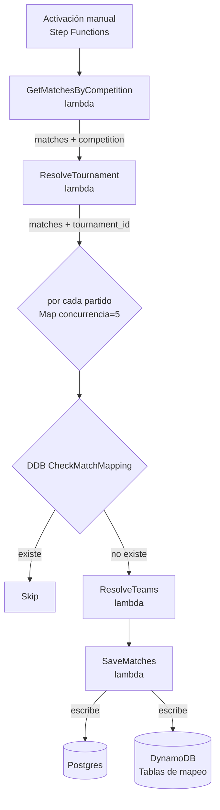
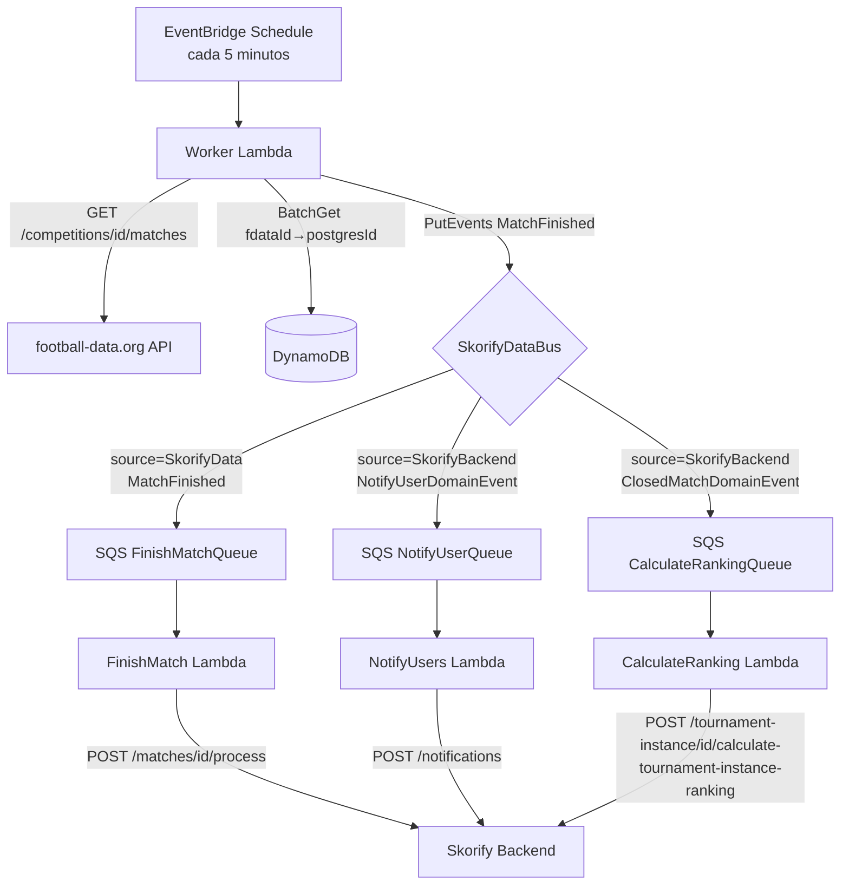

# Flujo ETL

## Descripción general

Dos sub-flujos en el `MatchProcessingStack` (desplegado como `SkorifyEventBridge`). Ambos comparten tablas DynamoDB que mapean IDs externos de football-data.org a UUIDs internos de Postgres.

## Sub-flujo 1 — CreateMatchesFlow (configuración única)

Se activa manualmente via AWS Step Functions. Obtiene los partidos de una competencia, resuelve o crea el torneo y los equipos en Postgres, y luego guarda cada partido.

### Descripción de lambdas

| Lambda | Qué hace | Tablas DDB leídas | Tablas DDB escritas |
|--------|----------|------------------|---------------------|
| `GetMatchesByCompetition` | Llama a football-data.org `GET /competitions/{id}/matches?stage=GROUP_STAGE` y parsea la respuesta | — | — |
| `ResolveTournament` | Busca el torneo en `tournamentMappingTable`; si no existe lo crea en Postgres y escribe el mapeo | tournamentMappingTable | tournamentMappingTable |
| `ResolveTeams` | Por partido: busca local y visitante en `teamMappingTable`; crea equipos faltantes en Postgres | teamMappingTable | teamMappingTable |
| `SaveMatches` | Construye `MatchEntity`, guarda en Postgres, escribe `fdataId → postgresId` en `matchMappingTable` | — | matchMappingTable |

Tipo de máquina de estados: EXPRESS, timeout: 5 min.

---

## Sub-flujo 2 — MatchProcessingFlow (cada 5 minutos)

Un scheduler de EventBridge dispara el Worker Lambda cada 5 minutos. El worker consulta football-data.org por partidos finalizados, mapea IDs externos a IDs de Postgres via DynamoDB, y publica eventos `MatchFinished` en el bus. Las lambdas de downstream consumen eventos a través de SQS.

- Frecuencia de polling: cada 5 minutos (`events.Schedule.rate(Duration.minutes(5))`)
- Reintentos: 3 intentos, backoff exponencial (1 s, 2 s, 4 s)
- Retención de DLQ: 14 días; `maxReceiveCount`: 3; visibility timeout: 90 s
- Límite de EventBridge: 10 eventos por llamada a `PutEvents` (el worker divide en lotes)

---

## Contratos de eventos

| Evento | Bus | Source | DetailType | Publicador | Campos del payload |
|--------|-----|--------|------------|------------|-------------------|
| Partido finalizado | SkorifyDataBus | `SkorifyData` | `MatchFinished` | Worker Lambda | `match_id`, `tournament_id`, `final_home_goals`, `final_away_goals`, `stage`, `timestamp` |
| Notificar usuario | SkorifyDataBus | `SkorifyBackend` | `NotifyUserDomainEvent` | Skorify Backend | payload específico del evento |
| Calcular ranking | SkorifyDataBus | `SkorifyBackend` | `ClosedMatchDomainEvent` | Skorify Backend | `match_id`, `tournament_id`, `instance_id` |

---

## Contratos de API del backend

| Lambda | Método | Path | Tipo de payload | Respuesta esperada |
|--------|--------|------|-----------------|-------------------|
| FinishMatch | POST | `/matches/{matchId}/process` | `MatchFinishedDetail` | 2xx (204 sin cuerpo) |
| NotifyUsers | POST | `/notifications` | `Record<string, unknown>` | 2xx |
| CalculateRanking | POST | `/tournament-instance/{instanceId}/calculate-tournament-instance-ranking` | `CalculateInstanceRankingDetail` | 2xx |

---

## API de football-data.org

- **URL base:** `https://api.football-data.org/v4`
- **Header de autenticación:** `X-Auth-Token: <token>`
- **Variable de entorno:** `FOOTBALL_DATA_API_TOKEN`
- **Endpoint usado:** `GET /competitions/{competitionId}/matches?stage=GROUP_STAGE`
- **Campos consumidos:** `id`, `utcDate`, `status`, `stage`, `competition.{id,name,code}`, `season.{startDate,endDate}`, `matchday`, `homeTeam.{id,name,shortName,tla,crest}`, `awayTeam.{id,name,shortName,tla,crest}`, `score.fullTime.{home,away}`

**Mapeo de etapa** (football-data.org → campo `stage` en Postgres):

| Valor football-data.org | Valor en Postgres |
|------------------------|------------------|
| `GROUP_STAGE` | `group` |
| `LAST_16`, `LAST_32`, `QUARTER_FINALS`, `SEMI_FINALS`, `THIRD_PLACE`, `FINAL` | `finals` |

**Mapeo de estado** (football-data.org → campo `status` en Postgres):

| Valor football-data.org | Valor en Postgres |
|------------------------|------------------|
| `SCHEDULED`, `TIMED`, `POSTPONED`, `SUSPENDED`, `CANCELED` | `scheduled` |
| `IN_PLAY`, `PAUSED` | `in_progress` |
| `FINISHED` | `finished` |
| (desconocido) | `draft` |

---

## Variables de entorno por lambda

| Lambda | Variable | Fuente |
|--------|----------|--------|
| Worker | `EVENT_BUS_NAME` | CDK: nombre del bus |
| Worker | `MATCH_MAPPING_TABLE` | CDK: nombre de tabla DynamoDB |
| Worker | `TOURNAMENT_MAPPING_TABLE` | CDK: nombre de tabla DynamoDB |
| Worker | `FOOTBALL_DATA_API_TOKEN` | Variable del host / contexto CDK |
| FinishMatch | `BACKEND_URL` | Prop `backendUrl` del stack CDK |
| NotifyUsers | `BACKEND_URL` | Prop `backendUrl` del stack CDK |
| CalculateRanking | `BACKEND_URL` | Prop `backendUrl` del stack CDK |
| GetMatchesByCompetition | `FOOTBALL_DATA_API_TOKEN` | Variable del host / contexto CDK |
| ResolveTournament | `DB_SECRET_ARN` | SSM `/skorify/{env}/db-secret-arn` |
| ResolveTournament | `TOURNAMENT_MAPPING_TABLE` | CDK: nombre de tabla DynamoDB |
| ResolveTeams | `DB_SECRET_ARN` | SSM `/skorify/{env}/db-secret-arn` |
| ResolveTeams | `TEAM_MAPPING_TABLE` | CDK: nombre de tabla DynamoDB |
| SaveMatches | `DB_SECRET_ARN` | SSM `/skorify/{env}/db-secret-arn` |
| SaveMatches | `MATCH_MAPPING_TABLE` | CDK: nombre de tabla DynamoDB |
